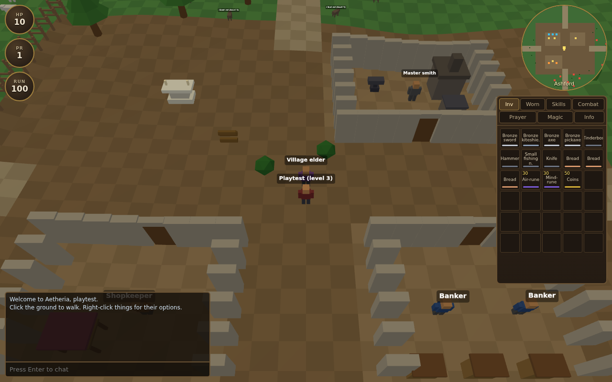
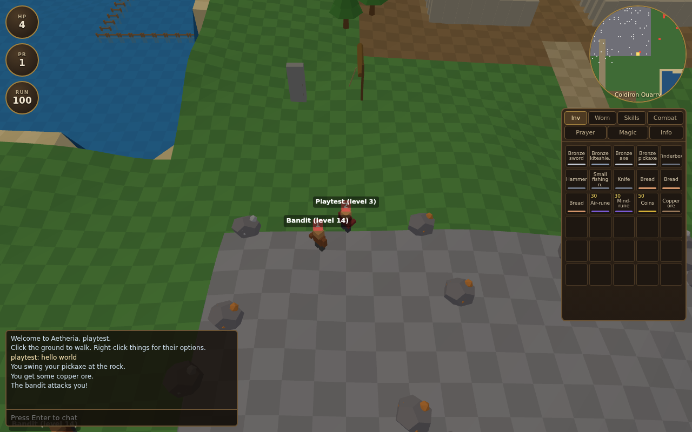

# Aetheria

A tick-based 3D MMORPG built in the spirit of the original browser RPGs of the
early 2000s: click-to-move on a tile grid, a 600 ms game tick, eighteen skills
that level on the classic experience curve, and an authoritative server that
owns every roll of the dice.

Everything is original — the code, the world, the item and monster catalogues,
and all of the art, which is generated from primitives at runtime. There are no
external assets to download.





## Two ways to play

**Multiplayer, on a server** — the real thing: several players in one world.

**Single player, in one file** — `npm run build:standalone` bundles the entire
game, server logic included, into `dist/aetheria.html`. Open that file in any
browser, including on a phone; the world ticks in the page and your character
saves to browser storage. No install, no network. Being single player, it has
no friends list, messaging or trading — those need the server build.

## Running it

```bash
npm install
npm start           # builds the client bundle and serves on http://localhost:8080
```

Then open <http://localhost:8080>, pick any name and password, and you are in.
A name that has never been used creates a new character.

```bash
npm run dev         # esbuild in watch mode alongside the server
npm test            # unit and integration tests (no browser needed)
npm run test:browser     # drives the real client in a real browser end to end
npm run test:mobile      # the standalone build, on an emulated iPhone with touch
npm run test:social      # two browsers, two players: friends, chat, follow, trade
npm run build:standalone # dist/aetheria.html - the whole game in one file
```

## What is in the world

| Region | Where | What is there |
| --- | --- | --- |
| **Ashford** | centre | bank, general store, smithy (furnace, anvil, range), altar, village elder |
| **Coldiron Quarry** | north | copper and tin at the mouth, then iron, coal, gold, mithril, adamantite deeper in |
| **Whisperwood** | west | ordinary, oak, willow and maple trees |
| **Lake Mere** | east | net, rod and cage fishing spots |
| **Ashford Pasture** | east of town | cows, for hides and beginner combat |
| **Goblin Camp / Bandit Camp** | north-west / north-east | levels 5 and 14 |
| **Old Barrows** | south | skeletons, level 21 |
| **Wyrm's Hollow** | far south-east | ogres and green dragons, levels 40 and 79 |

## Features

**Combat.** Melee, ranged and magic, each with its own accuracy and damage
rolls. Four combat styles decide which skill earns the experience. Fights are
one-on-one: a second monster will not join in, and you cannot steal someone
else's kill. Death drops everything but your three most valuable items.

**Skills.** All eighteen train and matter: attack, defense, strength, hits,
ranged, prayer, magic, cooking, woodcutting, fletching, fishing, firemaking,
crafting, smithing, mining, herblore, agility and thieving. The production
chains connect — mine ore, smelt it into bars, hammer the bars into equipment
you can actually wear.

**Controls.** Mouse: left-click acts, right-click opens the full menu, right-drag
orbits, wheel zooms. Touch: tap acts, long press opens the menu, drag orbits,
pinch zooms. On phones the side panel becomes a bottom sheet that collapses to
its tab strip.

**Playing together.** A friends list with live presence — friends show as green
dots on the minimap and you are told when they log in or out. Private messages,
an ignore list, a Follow option that tails another player across the map, and
two-stage trading: both sides must ask, offered items sit in escrow, any change
resets both acceptances, and a confirmation screen shows exactly what is on the
table before it completes.

**The rest.** 30-slot inventory and 96-slot bank, eleven equipment slots,
shops, prayers that drain points while active, spells that consume runes,
a quest, ground items with drop ownership, resource respawn timers, run
energy, public chat with overhead bubbles, and per-character persistence.

## How it fits together

```
shared/   world generation, items, NPCs, objects, spells, xp — runs on both sides
server/   authoritative tick loop, combat, skills, pathfinding, persistence
client/   Three.js renderer, procedural models, HTML UI
tools/    esbuild bundler, browser play test
test/     unit and integration tests
```

The client and the server both call `buildWorld(seed)`, so the terrain you see
is the terrain the server collides against — no map files are shipped or
transferred. The server sends a snapshot every tick; the client interpolates
between them.

See `CLAUDE.md` for a deeper tour of the architecture and conventions.
